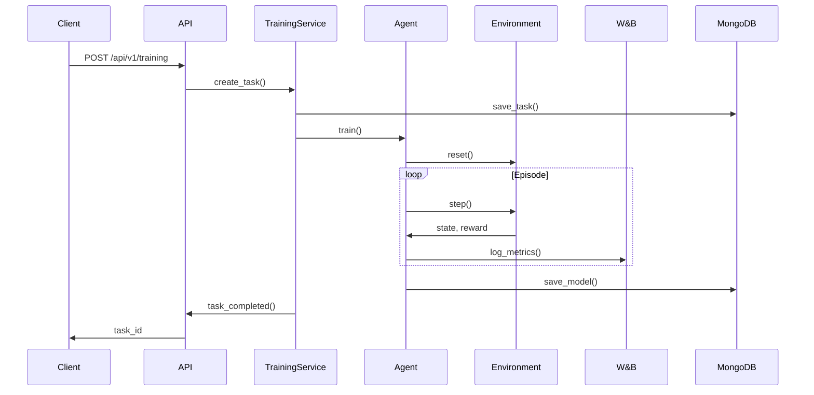
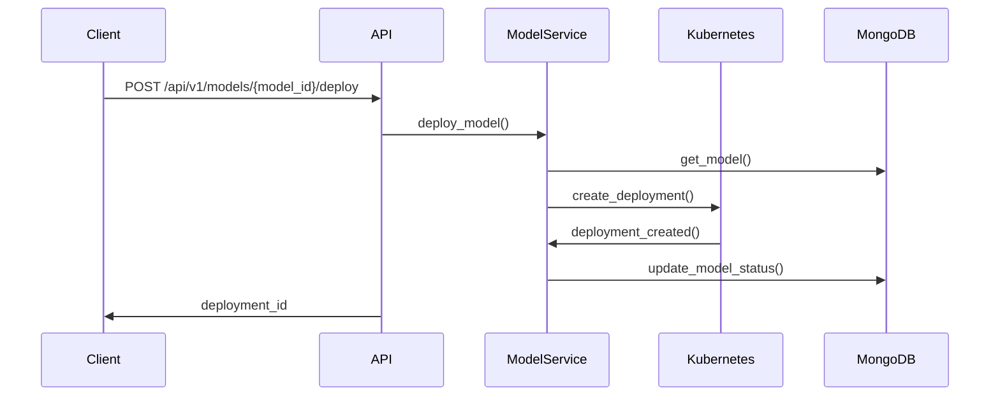
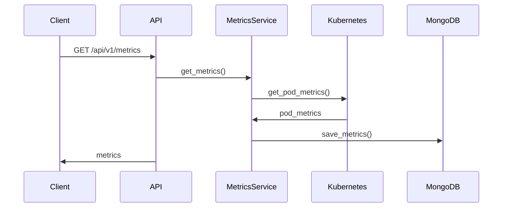

# Архитектура

## Обзор

LWMECPS Gym - это система для обучения с подкреплением, предназначенная для оптимизации размещения сервисов в Kubernetes кластере. Система состоит из нескольких компонентов, которые взаимодействуют между собой для достижения оптимального размещения сервисов.

## Компоненты системы

### 1. API слой

API слой предоставляет REST интерфейс для взаимодействия с системой. Он состоит из следующих компонентов:

#### Endpoints
- `/api/v1/training` - управление обучением
- `/api/v1/models` - управление моделями
- `/api/v1/metrics` - получение метрик

#### Модели
- `TrainingTask` - задача обучения
- `Model` - модель
- `Metrics` - метрики

#### Сервисы
- `TrainingService` - управление обучением
- `ModelService` - управление моделями
- `MetricsService` - сбор метрик

### 2. ML компоненты

ML компоненты отвечают за реализацию алгоритмов обучения. Они включают:

#### Агенты
- `QLearningAgent` - Q-learning
- `DQNAgent` - Deep Q-Network
- `PPO` - Proximal Policy Optimization

#### Сервисы
- `TrainingService` - управление обучением
- `ModelService` - управление моделями

#### Утилиты
- `metrics.py` - вычисление метрик
- `wandb_utils.py` - интеграция с W&B

### 3. Core компоненты

Core компоненты содержат базовую функциональность системы:

#### Модели
- `models.py` - базовые модели данных
- `config.py` - конфигурация системы

#### База данных
- `database.py` - работа с MongoDB
- `models.py` - модели данных

#### Интеграции
- `wandb_config.py` - конфигурация W&B
- `kubernetes_config.py` - конфигурация Kubernetes

### 4. Environment

Environment предоставляет среду для обучения:

#### Среда
- `LWMECPSEnv` - базовая среда
- `LWMECPSEnv2` - улучшенная версия
- `LWMECPSEnv3` - последняя версия

#### API
- `kubernetes_api.py` - интеграция с Kubernetes
- `testapp_api.py` - интеграция с тестовым приложением

## Взаимодействие компонентов

### 1. Процесс обучения



### 2. Развертывание модели



### 3. Сбор метрик



## Хранение данных

### 1. MongoDB

#### Коллекции
- `tasks` - задачи обучения
- `models` - модели
- `metrics` - метрики
- `deployments` - развертывания

#### Индексы
```javascript
db.tasks.createIndex({ "status": 1 })
db.models.createIndex({ "type": 1, "status": 1 })
db.metrics.createIndex({ "timestamp": 1 })
db.deployments.createIndex({ "model_id": 1 })
```

### 2. Weights & Biases

#### Проекты
- `lwmecps-gym` - основной проект
- `lwmecps-gym-models` - модели
- `lwmecps-gym-metrics` - метрики

#### Артефакты
- `models` - сохраненные модели
- `configs` - конфигурации
- `metrics` - метрики

## Безопасность

### 1. Аутентификация

```python
from fastapi import Depends, HTTPException, status
from fastapi.security import OAuth2PasswordBearer

oauth2_scheme = OAuth2PasswordBearer(tokenUrl="token")

async def get_current_user(token: str = Depends(oauth2_scheme)):
    credentials_exception = HTTPException(
        status_code=status.HTTP_401_UNAUTHORIZED,
        detail="Could not validate credentials",
        headers={"WWW-Authenticate": "Bearer"},
    )
    try:
        payload = jwt.decode(token, SECRET_KEY, algorithms=[ALGORITHM])
        username: str = payload.get("sub")
        if username is None:
            raise credentials_exception
    except JWTError:
        raise credentials_exception
    return username
```

### 2. Авторизация

```python
from fastapi import Depends, HTTPException, status
from fastapi.security import OAuth2PasswordBearer

async def check_permissions(
    user: str = Depends(get_current_user),
    required_permission: str = None
):
    if not has_permission(user, required_permission):
        raise HTTPException(
            status_code=status.HTTP_403_FORBIDDEN,
            detail="Not enough permissions"
        )
```

### 3. Шифрование

```python
from cryptography.fernet import Fernet

def encrypt_data(data: str, key: bytes) -> bytes:
    f = Fernet(key)
    return f.encrypt(data.encode())

def decrypt_data(encrypted_data: bytes, key: bytes) -> str:
    f = Fernet(key)
    return f.decrypt(encrypted_data).decode()
```

## Масштабирование

### 1. Горизонтальное масштабирование

```yaml
apiVersion: apps/v1
kind: Deployment
metadata:
  name: lwmecps-gym-api
spec:
  replicas: 3
  selector:
    matchLabels:
      app: lwmecps-gym-api
  template:
    metadata:
      labels:
        app: lwmecps-gym-api
    spec:
      containers:
      - name: api
        image: lwmecps-gym-api:latest
        resources:
          requests:
            memory: "256Mi"
            cpu: "250m"
          limits:
            memory: "512Mi"
            cpu: "500m"
```

### 2. Балансировка нагрузки

```yaml
apiVersion: v1
kind: Service
metadata:
  name: lwmecps-gym-api
spec:
  type: LoadBalancer
  ports:
  - port: 80
    targetPort: 8000
  selector:
    app: lwmecps-gym-api
```

### 3. Кэширование

```python
from fastapi_cache import FastAPICache
from fastapi_cache.backends.redis import RedisBackend
from redis import asyncio as aioredis

async def setup_cache():
    redis = aioredis.from_url("redis://localhost", encoding="utf8")
    FastAPICache.init(RedisBackend(redis), prefix="lwmecps-gym")
```

## Мониторинг

### 1. Prometheus метрики

```python
from prometheus_client import Counter, Histogram

TRAINING_REQUESTS = Counter(
    "training_requests_total",
    "Total number of training requests"
)

TRAINING_DURATION = Histogram(
    "training_duration_seconds",
    "Duration of training in seconds"
)
```

### 2. Логирование

```python
import logging

logging.basicConfig(
    level=logging.INFO,
    format="%(asctime)s - %(name)s - %(levelname)s - %(message)s"
)

logger = logging.getLogger(__name__)
```

### 3. Трейсинг

```python
from opentelemetry import trace
from opentelemetry.sdk.trace import TracerProvider
from opentelemetry.sdk.trace.export import BatchSpanProcessor
from opentelemetry.exporter.jaeger.thrift import JaegerExporter

def setup_tracing():
    trace.set_tracer_provider(TracerProvider())
    jaeger_exporter = JaegerExporter(
        agent_host_name="localhost",
        agent_port=6831,
    )
    span_processor = BatchSpanProcessor(jaeger_exporter)
    trace.get_tracer_provider().add_span_processor(span_processor)
```

## Резервное копирование

### 1. MongoDB бэкап

```bash
#!/bin/bash
BACKUP_DIR="/backup/mongodb"
DATE=$(date +%Y%m%d_%H%M%S)
mongodump --uri="mongodb://localhost:27017/lwmecps" --out="$BACKUP_DIR/$DATE"
```

### 2. Бэкап моделей

```bash
#!/bin/bash
BACKUP_DIR="/backup/models"
DATE=$(date +%Y%m%d_%H%M%S)
cp -r /models/* "$BACKUP_DIR/$DATE"
```

## Устранение неполадок

### 1. Проверка логов

```bash
# Логи API
kubectl logs -n lwmecps-gym -l app.kubernetes.io/name=lwmecps-gym

# Логи MongoDB
kubectl logs -n lwmecps-gym -l app.kubernetes.io/name=mongodb

# Логи обучения
kubectl logs -n lwmecps-gym -l app.kubernetes.io/name=training
```

### 2. Проверка статуса

```bash
# Статус подов
kubectl get pods -n lwmecps-gym

# Статус сервисов
kubectl get svc -n lwmecps-gym

# Статус PVC
kubectl get pvc -n lwmecps-gym
```

### 3. Проверка событий

```bash
kubectl get events -n lwmecps-gym
```

### 4. Проверка конфигурации

```bash
# Проверка значений Helm
helm get values lwmecps-gym -n lwmecps-gym

# Проверка конфигурации подов
kubectl describe pod -n lwmecps-gym -l app.kubernetes.io/name=lwmecps-gym
``` 